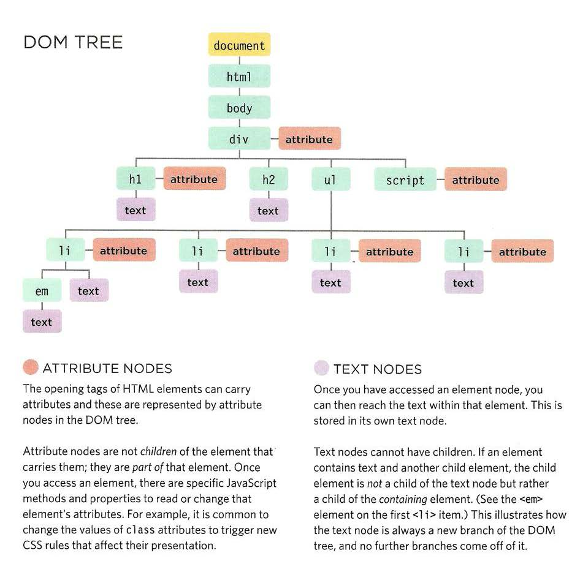

## Understanding The Problem Domain Is The Hardest Part Of Programming

Writing code is a lot like putting together a jigsaw puzzle.

- Figure out what the major components of the picture are
- Sort the pieces by color or component
- Put together all the border pieces
- Put together each component of the picture from the piles you created
  
```html
What can you do about it?
If understanding the problem domain is the hardest part of programming and you want to make programming easier, you can do one of two things:
Make the problem domain easier
Get better at understanding the problem domain

You can often make the problem domain easier by cutting out cases and narrowing your focus to a particular part of the problem.
```

## What’s the Difference Between Primitive Values and Object References in JavaScript?

- What JavaScript data types fall into each category.

>primitive type: Boolean, Null, Undefined, Number, BigInt, String, Symbol
>Objects (including arrays, functions, and dates)

- The difference between a value and a reference.

>When a primitive value is assigned to a variable (eg let foo = ‘bar’), the variable is set to that value directly.
>When the variable is assigned with an object, however, things are different. Instead of containing the value directly, that variable contains a reference to it.

- The difference between immutable and mutable data.

>One key difference between primitive values and object references is mutability. Primitive values are immutable and object references are mutable.

```html

Summary

JavaScript currently supports eight data types. All of these data types (Booleans, Null, Undefined, Number, BigInt, String, Symbol) are primitive values except for object references.

Many common data types such as arrays, functions, and dates are object references under the hood.

Primitive values can be stored in variables directly. Objects, on the other hand, are stored as references. A variable that has been assigned an object does not store that object directly, it stores the memory address of the location that the object exists at.

Primitive values are immutable — they cannot be changed after being created. Object references, however, are mutable and can be changed.

Since objects are stored as references, special care must be taken when duplicating objects and when performing equality checks on objects.

Understanding how these operations work can be confusing for newcomers to JavaScript, but they make sense once you understand how the language’s type system works.

Developing a strong grasp of primitive values, object references, and mutability is a critical step in progressing past the beginner stages of JavaScript programming.
```

## Object Literals

- Objects group together a set of variables and functions to create a model
of a something you would recognize from the real world. In an object,
variables and functions take on new names.

>IN AN OBJECT: VARIABLES BECOME KNOWN AS METHODS
>IN AN OBJECT: FUNCTIONS BECOME KNOWN AS PROPERTIES
>If a variable is part of an object, it is called property;
>If a function is part of an object, it is called a method.
>property (key: value) pair.

- Access the properties or methods of an object using dot notation or square brackets.
  
## Document Object Model

- Body of HTML Page

```html
<html>
<body>
<div id="page" >
<h1 id="header">List</h1>
<h2>Buy groceries</h2>
<ul >
<li id="one" class="hot" ><em>fresh</em> figs</li>
<li id="two" class="hot" >pine nuts</li>
<li id="three" class="hot">honey</li >
<li id="four" >balsamic vinegar</li>
</ ul >
<script src="js/l i st. js "></scri pt>
</ div>
</ body>
</ html >
```

- DOM tree


- getElementby**()
<br>
- item()
<br>
- document.getElementByid('one').firstChild.nextSibling.nodeValue
<br>
- ACCESS & UPDATE TEXT WITH TEXTCONTENT(& INN ERTEXT)
<br>

```html 

summary:

The browser represents the page using a DOM tree.
DOM trees have four types of nodes: document nodes,
element nodes, attribute nodes, and text nodes.
You can select element nodes by their id or cl ass
attributes, by tag name, or using CSS selector syntax.
Whenever a DOM query can return more than one
node, it will always return a Nadel i st.
From an element node, you can access and update its
content using properties such as textContent and
i nnerHTML or using DOM manipulation techniques.
An element node can contain multiple text nodes and
child elements that are siblings of each other.
In older browsers, implementation of the DOM is
inconsistent (and is a popular reason for using jQuery).
Browsers offer tools for viewing the DOM tree.

```
