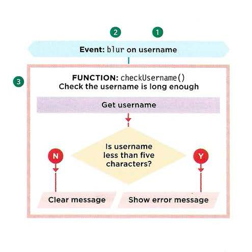

## Forms

- Form Controls
  >adding text
  >passing input
  >text areae
  >making choices
  >checkboxes
  >dropdown boxes
  >submitting formse
  >image buttons
  >uploading files

- Whenever you want to collect information from visitors you will need a form, which lives inside a ```<form>``` element.
- Information from a form is sent in name/value pairs.
- Each form control is given a name, and the text the user types in or the values of the options they selectare sent to the server.
- HTML5 introduces new form elements which make it easier for visitors to fill in forms.

## Lists, Tables & Forms

### List

- list-style-type
- list-style-image
- list-style-position
- list-style

### Table properties

- ```<table>```
- ```<thead>```
- ```<tr>```
- ```<th>```
- ```<td>```
- ```<tfoot>```

Table example:
```
<h1>First Edition Auctions</h1>
<table>
<tr>
   <th>Author</th>
   <th>Title</th>
   <th class="money">Reserve Price</th>
   <th class="money">Current Bid</th>
</tr>
<tr>
   <td>E.E. Cummings</td>
   <td>Tulips & Chimneys</td>
   <td class="money">$2,000.00</td>
   <td class="money">$2,642.50</td>
</tr>
<tr class="even">
   <td>Charles d'Orleans</td>
   <td>Poemes</td>
   <td class="money"></td>
   <td class="money">$5,866.00</td>
</tr>
<tr>
   <td>T.S. Eliot</td>
   <td>Poems 1909 - 1925</td>
   <td class="money">$1,250.00</td>
   <td class="money">$8,499.35</td>
</tr>
<tr class="even">
   <td>Sylvia Plath</td>
   <td>The Colossus</td>
   <td class="money"></td>
   <td class="money">$1031.72</td>
</tr>
</table>
```

### Styling forms

- styling text input
- styling submit buttons
- styling fieldset and legends
- aligning form
  

### Summary

>In addition to the CSS properties covered in other
chapters which work with the contents of all elements,
there are several others that are specifically used to
control the appearance of lists, tables, and forms.

>List markers can be given different appearances
using the list-style-type and list-style image
properties.

>Table cells can have different borders and spacing in
different browsers, but there are properties you can
use to control them and make them more consistent.

>Forms are easier to use if the form controls are
vertically aligned using CSS.

>Forms benefit from styles that make them feel more
interactive.


## Event

"When you browse the web, your browser registers different
types of events. It's the browser's way of saying, "Hey, this
just happened ." Your script can then respond to these events."


- Event handling
  
>Select the element node(s) you want the script to respond to.

>Indicate which event on the selected nodes will trigger the response.

>State the code you want to run when the event occurs.



- addEventListener()
  
- callback function

- event.preventDefault()

### Summary

- Events are the browser's way of indicating when something has happened (such as when a page has finished loading or a button has been clicked).
  
- Binding is the process of stating which event you are waiting to happen, and which element you are waiting for that event to happen upon.
  
- When an event occurs on an element, it can trigger a JavaScript function. When this function then changes the web page in some way, it feels interactive because it has responded to the user.
  
- You can use event delegation to monitor for events that happen on all of the children of an element.
  
- The most commonly used events are W3C DOM events, although there are others in the HTMLS specification as well as browser-specific events.