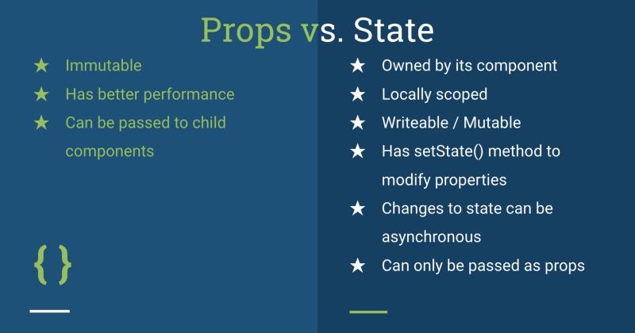

## Readings: State and Props


### React lifecycle


- Based off the diagram, what happens first, the ‘render’ or the ‘componentDidMount’?

Mounting
When an instance of a component is being created and inserted into the DOM it occurs during the mounting phase. 
Constructor, ```static getDerivedStateFromProps```, ```render```, ```componentDidMount```, 
and ```UNSAFE_componentWillMount``` all occur in this order during mounting.

- What is the very first thing to happen in the lifecycle of React?
  ```static getDerivedStateFromProps()``` The static getDerivedStateFromProps is the first React lifecycle method to be invoked during the updating phase.


- Put the following things in the order that they happen: ```componentDidMount```, ```render```, ```constructor```, ```componentWillUnmount```, ```React Updates```

order should be ```constructor```, ```render```, ```React Updates```, ```componentDidMount```, ```componentWillUnmount```.

- What does componentDidMount do?

The ```componentDidMount()``` method allows us to execute the React code when the component is already placed in the DOM (Document Object Model). 
This method is called during the Mounting phase of the React Life-cycle i.e after the component is rendered.


### React State Vs Props



- What types of things can you pass in the props?

```can be any JavaScript data type from integers over objects to arrays```

- What is the big difference between props and state?

```Props are used to pass data from one component to another.``` 
```The state is a local data storage that is local to the component only and cannot be passed to other components.```

- When do we re-render our application?

```React schedules a render every time the state of a component changes. that's re-render.```

- What are some examples of things that we could store in state?

```whenever we are working with any data, we always use state for storing that data which may be a string , number or any complex object.```
