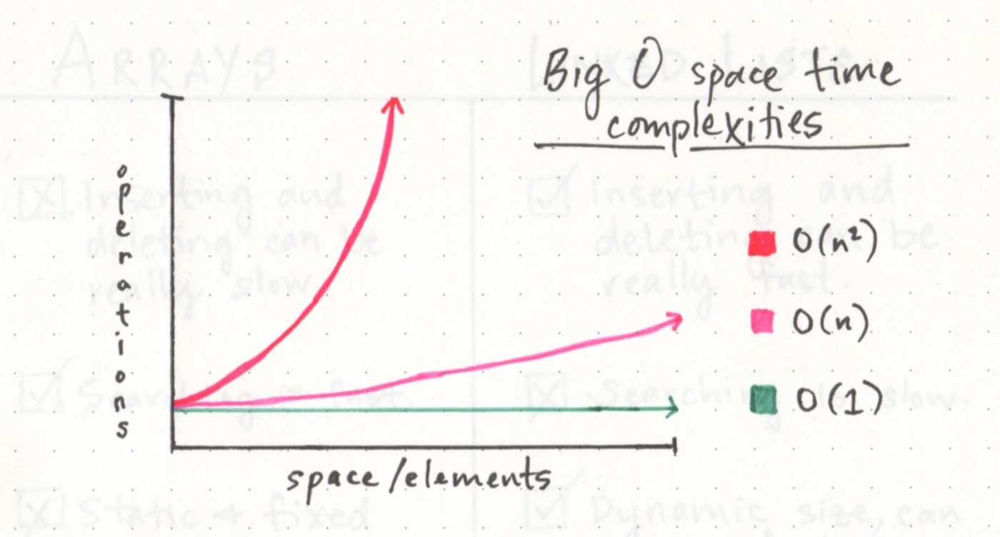
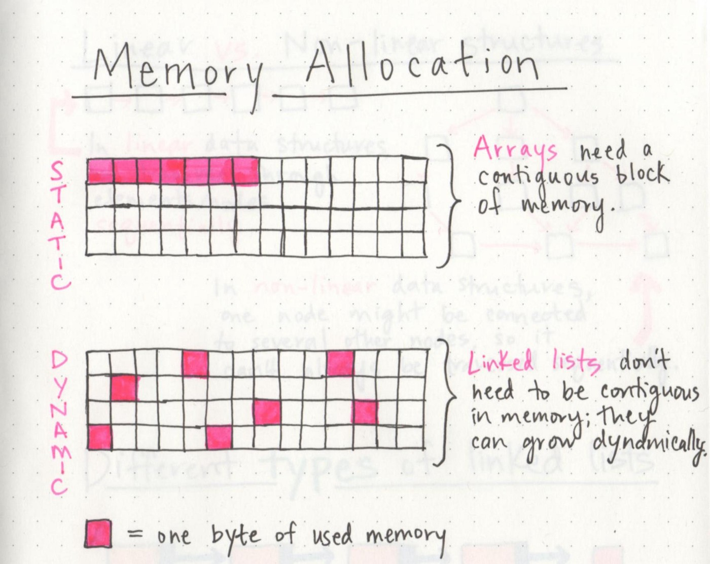

## Big O: Analysis of Algorithm Efficiency
[Big O reference sheet](https://codefellows.github.io/common_curriculum/data_structures_and_algorithms/Code_401/class-05/resources/big_oh.html)

## Linked list
[Note reference article](https://codefellows.github.io/common_curriculum/data_structures_and_algorithms/Code_401/class-05/resources/singly_linked_list.html)

### terminology

- Linked List - A data structure that contains nodes that links/points to the next node in the list.
- Singly - Singly refers to the number of references the node has. A Singly linked list means that there is only one reference, and the reference points to the Next node in a linked list.
- Doubly - Doubly refers to there being two (double) references within the node. A Doubly linked list means that there is a reference to both the Next and Previous node.
- Node - Nodes are the individual items/links that live in a linked list. Each node contains the data for each link.
- Next - Each node contains a property called Next. This property contains the reference to the next node.
- Head - The Head is a reference of type Node to the first node in a linked list.
- Current - The Current is a reference of type Node to the node that is currently being looked at. When traversing, you create a new Current variable at the Head to guarantee you are starting from the beginning of the linked list.

### linear vs non-linear

### memory allocation

- A linked list is made up of a series of nodes, which are the elements of the list.

- The starting point of the list is a reference to the first node, which is referred to as the head. 

### Linked list types

- singly linked list
- doubly linked list
- circular linked list

### Grow linked list

- First, we find the head node of the linked list.
- Next, we’ll make our new node, and set its pointer to the current first node of the list.
- Lastly, we rearrange our head node’s pointer to point at our new node.