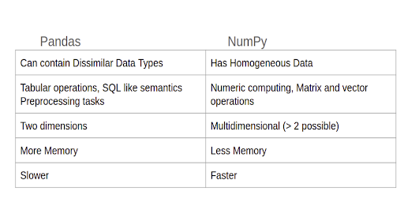

## Pandas

### Pandas vs NumPy



### Object creation

```angular2html
dates = pd.date_range("20130101", periods=6)

DatetimeIndex(['2013-01-01', '2013-01-02', '2013-01-03', '2013-01-04',
               '2013-01-05', '2013-01-06'],
              dtype='datetime64[ns]', freq='D')


df = pd.DataFrame(np.random.randn(6, 4), index=dates, columns=list("ABCD"))
                   A         B         C         D
2013-01-01  0.469112 -0.282863 -1.509059 -1.135632
2013-01-02  1.212112 -0.173215  0.119209 -1.044236
2013-01-03 -0.861849 -2.104569 -0.494929  1.071804
2013-01-04  0.721555 -0.706771 -1.039575  0.271860
2013-01-05 -0.424972  0.567020  0.276232 -1.087401
2013-01-06 -0.673690  0.113648 -1.478427  0.524988
```

### Viewing Data

```Dataframe or df```
- df.head()
- df.tail(3)
- df.index()
- df.to_numpy()
- df.describe()
- df.T transposing data
- df.sort_index()
- df.sort_values()

### Selection

- df["A"]
- df[0:3]
- df.loc[date[0]] by label
- df.iloc integer location
- df.isna

### Operations
- df.mean()
- df.sub()
- df.apply(function)

### String method
- pd.series.str.lower()

### Merge
- pd.concat()

### Grouping
- df.groupby()

### ploting
using matplotlib.

### Read Excel
```angular2html
pd.read_excel("foo.xlsx", "Sheet1", index_col=None, na_values=["NA"])

    Unnamed: 0          A          B          C          D
0   2000-01-01   0.350262   0.843315   1.798556   0.782234
1   2000-01-02  -0.586873   0.034907   1.923792  -0.562651
2   2000-01-03  -1.245477  -0.963406   2.269575  -1.612566
3   2000-01-04  -0.252830  -0.498066   3.176886  -1.275581
4   2000-01-05  -1.044057   0.118042   2.768571   0.386039
..         ...        ...        ...        ...        ...
995 2002-09-22 -48.017654  31.474551  69.146374 -47.541670
996 2002-09-23 -47.207912  32.627390  68.505254 -48.828331
997 2002-09-24 -48.907133  31.990402  67.310924 -49.391051
998 2002-09-25 -50.146062  33.716770  67.717434 -49.037577
999 2002-09-26 -49.724318  33.479952  68.108014 -48.822030
```

