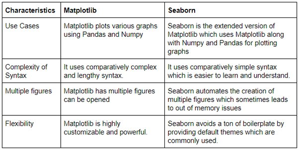

## Matplotlib Seaborn and bokeh

- Matplotlib is the most popular python package for 2d graphics, can do basic plotting.
- Seaborn is built on top of Matplotlib and has fancier visualization.
- bokeh is for interactive visualization, can handle plotting of data to the users.

****Matplotlib vs Seaborn****


****Simple Matplotlib example from readings****

```angular2html
import numpy as np # import numpy and set alias np

X = np.linspace(-np.pi, np.pi, 256, endpoint=True) # Numpy array with 256 values ranging from -pi to +pi
C, S = np.cos(X), np.sin(X) # display cosine and sine 2d figures.
```

****Chane colors and line widths****
```angular2html
# change S line color to read with line's width to 5, line style is solid.
plt.plot(X, S, color="red",  linewidth=5, linestyle="-")

```
****Subplot****

Plot partial data and display figures dividely.

****Axes****

Similar to subplot but allow placement of plot at any location of the figure.

****Set ticks****

Provide multiple ticks to suit data plotting.

****Moving spines****

tilt figures in the axis for better visualization

****Add legend****

```angular2html
plt.legend(loc='upper left', frameon=False)
```

****Annotate axis****

```plt.annotate()```

### Animation
- drip drop
- earthquake

other references see this link: (credit: code fellows)

[Other types of plots, quick references](https://github.com/rougier/matplotlib-tutorial#figures-subplots-axes-and-ticks)


